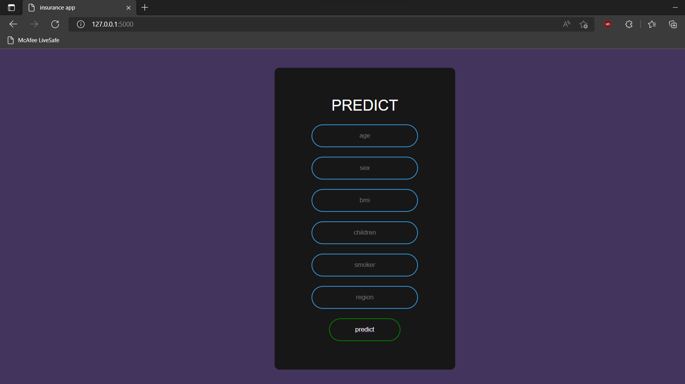

# Flask-app-for-machine-learning

## how to run

* open cmd
* cd into the working directory
* run : `python app.py`  
* open your favourite web browser 
* open  your local host using the url :

  * ```
    http://127.0.0.1:5000/
    ``` 
* enjoy :)